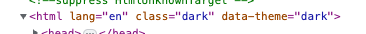

# Storybook Addon: Tailwindcss Dark Mode Toggle
Tiny tailwindcss dark mode toggle. It will add `data-theme="dark"` as well as `class="dark"` to the `<html />` element.



## Installation

```sh
npm i -D storybook-addon-tw-dm-toggle
```

## Usage

```js
// .storybook/main.js

module.exports = {
  addons: ['storybook-addon-tw-dm-toggle'],
};
```

## License

MIT
